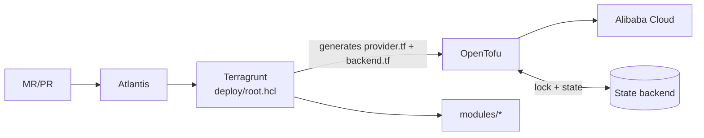

# 🏗️ OpenTofu for Alibaba Cloud

An infrastructure-as-code platform for **Alibaba Cloud**: reusable **OpenTofu** modules (`modules/`), a **Terragrunt** implementor layer per tenant and environment (`deploy/`), and **Atlantis** MR/PR execution (`atlantis.yaml`).

Every value you change lives in a small instance file. One leaf directory is one state and one Atlantis project, so a plan, a lock and a review always cover one clear boundary.

---

## ✨ Why This Template?

*   **🧱 Reusable Modules:** VPC, subnet, EIP, NAT (SNAT/DNAT), security group, VPC peering, route table, CEN, CBWP, KMS, RAM, OSS, RDS, Redis/Tair, Kafka, Elasticsearch, ECS, CLB and ALB. No backend, provider or credentials inside a module.
*   **🗂️ One State per Leaf:** State key `<tenant>/<env>/<leaf path>/<stack>.tfstate`, isolated per tenant, environment and stack.
*   **📝 Instance Files Hold Every Value:** Leaves are wiring only. A typo in an instance file fails the leaf instead of being ignored.
*   **🔒 Five Locking Backends:** Alibaba OSS (Tablestore lock), S3-compatible, GitLab, Gitea and generic HTTP state. Locking is never disabled.
*   **🔑 Tenant-Prefixed Credentials:** `<TENANT>_<ENV>_*` variables keep several tenants on one Atlantis server apart; global overrides are refused.
*   **🚦 Atlantis Gate:** Explicit project per leaf, autodiscovery off, autoplan only for what changed.
*   **🌍 Mandatory Region, Zones and Tags:** A deployment without them fails before any resource.
*   **✅ Offline Validation for CI:** `scripts/validate-tenant.sh` validates any tenant without state or credentials.
*   **🤫 Generated Secrets in the MR Comment:** Random ECS/RDS/RAM/Redis/Kafka/Elasticsearch secrets are posted after apply.

---

## 🏗️ Architecture at a Glance



Detail: [docs/ARCHITECTURE.md](docs/ARCHITECTURE.md) (what each part is) and [docs/WORKFLOWS.md](docs/WORKFLOWS.md) (how changes run).

---

## ⚠️ Before You Apply

*   **Apply only through Atlantis** (or an explicit, reviewed procedure). Never apply, destroy, move state or migrate a backend by hand on a shared environment.
*   **Generated secrets appear in the MR/PR comment.** Everyone with read access sees them; rotate after the first login.
*   **`s3` state against Alibaba OSS cannot lock.** Use `type = "oss"` (Tablestore lock).
*   **Open the Transit Router service once in the console** before the first `cen` apply; it is not automated.
*   **A rename can destroy and recreate.** Check names, state keys and plans for unexpected replace.

---

## 🚀 Getting Started

### 📋 Prerequisites

*   **OpenTofu** `~> 1.10.0` and **Terragrunt** `~> 0.93.0`.
*   Providers: `aliyun/alicloud ~> 1.293`, `hashicorp/random ~> 3.7` (ecs, rds, redis, kafka, elasticsearch) and `hashicorp/time ~> 0.14` (oss). Registry access or a provider mirror.
*   An **Atlantis** server with OpenTofu and Terragrunt, and a state backend (for OSS: bucket, Tablestore instance and table with `LockID`, a RAM user; see [ARCHITECTURE](docs/ARCHITECTURE.md#5-remote-state)).
*   An Alibaba Cloud account with a RAM identity for the provider.

### 📁 Repository Layout

| Path | Role |
|---|---|
| `modules/` | The 21 reusable modules. No backend, provider config or credentials. |
| `deploy/root.hcl` | Root include. Generates `provider.tf` (validated `region`) and `backend.tf`; supplies `region`, `zones` and forwards the tenant's `base_tags`. |
| `deploy/_common/` | `state.hcl` (backend templates). |
| `deploy/<tenant>-<env>/` | `tenant.hcl` (tenant, env, `base_tags`, state settings), `provider.hcl` (region, zones), one directory per stack. Each holds a wiring-only `terragrunt.hcl` plus instance files (`*.hcl`). |
| `deploy/example-stage/` | Reference tenant. Copy it; never register it in Atlantis. Every instance file explained: [README](deploy/example-stage/README.md). |
| `docs/` | [ARCHITECTURE.md](docs/ARCHITECTURE.md) and [WORKFLOWS.md](docs/WORKFLOWS.md). |
| `scripts/` | `check-atlantis.sh`, `check-deploy.sh`, `validate-tenant.sh`. Module unit tests live in `modules/*/tests/` and `modules/*/instances/tests/`. |

Names follow `<component>-<instance>-c1-<tenant>-<env>` (`c1` is a fixed infix), for example `vpc-1-c1-example-stage`.

---

## 🛠️ Deployment

### 🧬 New Tenant

1.  Copy `deploy/example-stage` to `deploy/<tenant>-<env>`.
2.  Rename tenant/env in `tenant.hcl` and every instance file, name and reference. Never edit a `terragrunt.hcl`.
3.  Replace region, zones, state settings, CIDRs and other values; set the tenant-prefixed variables below on the Atlantis server.
4.  Review dependencies, then open an MR that adds the tenant's project block to `atlantis.yaml`.

Full steps and the project block: [WORKFLOWS.md](docs/WORKFLOWS.md#1-onboard-a-tenant).

### 🔑 Credentials

Credentials are injected only through the environment. Every variable starts with the tenant and environment (`<TENANT>_<ENV>_`, upper case, `-` replaced by `_`); `deploy/root.hcl` maps them to the names the provider and backend read. For `example-stage`:

| Variable | Use |
|---|---|
| `EXAMPLE_STAGE_ALIBABA_CLOUD_ACCESS_KEY_ID` | Provider access key ID. Required. |
| `EXAMPLE_STAGE_ALIBABA_CLOUD_ACCESS_KEY_SECRET` | Provider access key secret. Required. |
| `EXAMPLE_STAGE_STATE_ACCESS_KEY_ID` | s3 or oss state access key ID. Required for those. |
| `EXAMPLE_STAGE_STATE_SECRET_ACCESS_KEY` | s3 or oss state secret key. Required for those. |
| `EXAMPLE_STAGE_STATE_USERNAME` | gitlab, gitea, http state user. Required for those. |
| `EXAMPLE_STAGE_STATE_PASSWORD` | gitlab, gitea, http state token or password. Required for those. |
| `EXAMPLE_STAGE_ECS_PASSWORD` | ECS login password (8-30 letters and digits with upper case, lower case and a digit). Optional. |
| `EXAMPLE_STAGE_RDS_ACCOUNT_PASSWORDS` | JSON map of instance name to account name to password. Optional. |
| `EXAMPLE_STAGE_REDIS_PASSWORDS` | JSON map of instance name to default-account password. Optional. |
| `EXAMPLE_STAGE_KAFKA_SASL_PASSWORDS` | JSON map of instance name to SASL user name to password. Optional. |
| `EXAMPLE_STAGE_ELASTICSEARCH_PASSWORDS` | JSON map of instance name to `elastic` user password. Optional. |
| `EXAMPLE_STAGE_ECS_IMAGE_ID` | Public ECS image ID of the target region, the ecs leaf's `image_id` fallback. Not checked up front: an empty value fails the ecs module validation at plan ("instance_type and image_id are required."). Needed to plan the ecs leaf unless its instance files set `image_id`. |
| `EXAMPLE_STAGE_KMS_INSTANCE_ID` | Existing KMS instance ID, the kms leaf's `dkms_instance_id` fallback. Not checked up front: an empty value fails the kms module validation at plan ("dkms_instance_id must not be empty."). Needed to plan the kms leaf unless its instance files set it. |

A missing provider or state credential fails before any resource, naming the variable. A global `TF_VAR_*` or an unprefixed credential is refused so it cannot reach another tenant. Enforcement, secret sources and the refusal list: [ARCHITECTURE.md](docs/ARCHITECTURE.md#6-credentials). `terragrunt render --json` prints the mapped values; do not run it with real secrets.

### 🗄️ State Backend

`tenant.hcl` selects the backend in `state.type`:

| type | Required settings | Locking |
|---|---|---|
| `s3` | `bucket`, `region`, `endpoint` | `use_lockfile = true`; refused when `endpoint` is an Alibaba OSS host (`aliyuncs.com`) |
| `oss` | `bucket`, `region`, `endpoint`, `tablestore_endpoint`, `tablestore_table` | Tablestore row (`LockID`) |
| `gitlab` | `base_url`, `project_id` | HTTP POST lock / DELETE unlock |
| `gitea` | `base_url`, `owner` | HTTP POST lock / DELETE unlock; needs a Gitea with the Terraform state registry (1.26+) |
| `http` | `base_url` | HTTP LOCK / UNLOCK |

An unknown `type` or a missing setting fails at Terragrunt time. The state key is part of the deployment contract; changing it needs a backup and a migration plan. Why `s3` cannot lock on OSS: [ARCHITECTURE.md](docs/ARCHITECTURE.md#alibaba-oss-state).

### 🤖 Atlantis

`atlantis.yaml` has `autodiscover.mode: disabled` and one explicit project per leaf, all using the single `terragrunt` workflow with OpenTofu. Autodiscovery would plan the wrong directories and could make `deploy/example-*` an execution target. Run Atlantis with `--silence-no-projects`, set `allowed_overrides: []` and `apply_requirements: [approved, mergeable]` in the server-side `repos.yaml`, and prefer one credential set per server where tenants must not see each other's access. The project block, `when_modified` rules and apply order: [WORKFLOWS.md](docs/WORKFLOWS.md#2-register-atlantis-projects).

---

## 🕹️ Usage & Commands

### 🧹 Formatting

```sh
tofu fmt -check -recursive modules          # module formatting
(cd deploy && terragrunt hcl fmt --check)   # Terragrunt formatting
```

### 🔍 Repository Checks

```sh
bash scripts/check-atlantis.sh                 # atlantis.yaml guard: autodiscovery off, one workflow, no example-* project
bash scripts/check-deploy.sh                   # leaf guard: terragrunt.hcl holds no user values; env and backend renders
bash scripts/validate-tenant.sh [tenant ...]   # offline validate of every tenant, or the named ones
```

### 🚦 Atlantis Comments

```sh
atlantis plan -p <tenant>-<env>-<leaf>     # plan one project, e.g. a dependent after its upstream leaf applied
atlantis apply -p <tenant>-<env>-<leaf>    # apply the reviewed plan of one project
```

Leaves apply in dependency order; Atlantis does not infer it. See [WORKFLOWS.md](docs/WORKFLOWS.md#4-apply-order).

---

## 🧪 Testing

```sh
(cd modules/<m> && tofu init -backend=false && tofu test)               # module unit tests
(cd modules/<m>/instances && tofu init -backend=false && tofu test)     # modules with an instances/ wrapper
bash scripts/validate-tenant.sh                                          # CI: exit 0 OK, 1 validation failed, 2 bad tenant argument
```

`validate-tenant.sh` needs no state or tenant credentials, only registry access or a provider mirror (`TF_CLI_CONFIG_FILE`). *Note: apply, destroy, state surgery and backend migration run only through Atlantis or a reviewed procedure.* CI usage: [WORKFLOWS.md](docs/WORKFLOWS.md#5-local-and-ci-validation).

---

## ✍️ Authors

*   **Dimas Restu Hidayanto** - *Initial Work & Architecture* - [DimasKiddo](https://github.com/dimaskiddo)

---

## 🏗️ Dependencies

*   **[OpenTofu](https://opentofu.org/)** - IaC execution engine
*   **[Terragrunt](https://terragrunt.gruntwork.io/)** - Implementation layer, backend and provider generation
*   **[Atlantis](https://www.runatlantis.io/)** - MR/PR plan and apply gate
*   **[aliyun/alicloud](https://registry.terraform.io/providers/aliyun/alicloud/latest)** - Alibaba Cloud provider
*   **[hashicorp/random](https://registry.terraform.io/providers/hashicorp/random/latest)** - Generated passwords
*   **[hashicorp/time](https://registry.terraform.io/providers/hashicorp/time/latest)** - OSS settle wait

---

## ⚠️ Disclaimer

**DO WITH YOUR OWN RISK (DWYOR)**. This software is provided "as is", without warranty of any kind, express or implied. Applying it creates, changes and can destroy real Alibaba Cloud resources and incurs cost. A plan may replace or delete resources; review every plan. The authors are not responsible for any damage, data loss or charges caused by the use of this repository.

---

## ⚖️ License

Distributed under the **MIT License**. See `LICENSE` for more information.

---
**OpenTofu for Alibaba Cloud** — *Reviewed, locked and reproducible infrastructure.* ☁️🏗️
