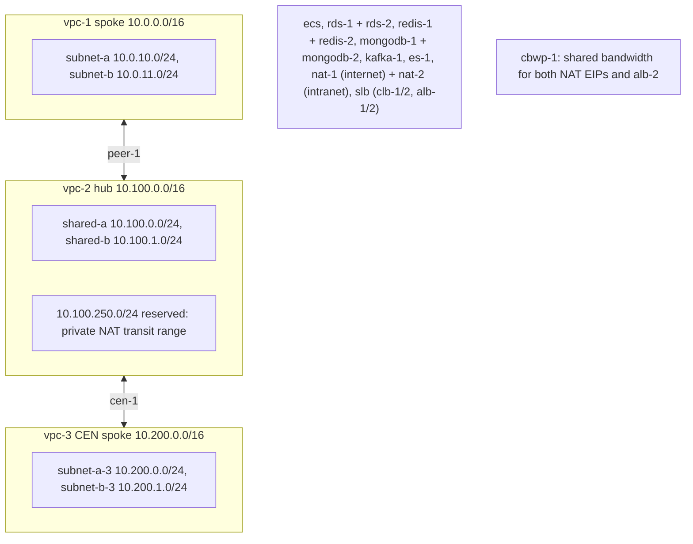

# example-stage

Reference tenant. Copy it to start a new tenant; it is never an Atlantis project and never an apply target.

## How a leaf works

Each directory with a `terragrunt.hcl` is a leaf with its own state. The `terragrunt.hcl` is wiring only and is never edited. Every value you change lives in an **instance file**: a `*.hcl` next to it with a single `locals { ... }` block.

- One leaf per component, one state per leaf, any number of instance files. Every file sets `name = "<component>-<instance>-c1-<tenant>-<env>"` by convention (the format is not validated; `<component>` is a short label such as `app`, `sg`, `rt`); that value is the resource name and the state address key, so renaming a file, or moving it within the same leaf (for `subnet`, the same VPC folder), does not touch state. For `nat/snat`, `nat/dnat` and a system-table `route-table`, `name` is only the state key. Keep the file name equal to `name` by convention. An empty leaf, a file without `name`, or a duplicate `name` fails before any resource is touched.
- `subnet` keeps its files in folders named after their VPC (`subnet/vpc-1-c1-example-stage/*.hcl`). Subnet names stay unique across folders; still one state.
- Other resources are referenced by name: the `name` value of the resource in the other leaf (`vpc = "vpc-1-c1-example-stage"`). Dependency paths are fixed per component in `terragrunt.hcl`.
- `tenant.hcl` `base_tags` (here `env = stage`) go on every taggable resource of the tenant (resources the provider cannot tag are skipped; see [docs/ARCHITECTURE.md](../../docs/ARCHITECTURE.md#8-untaggable-resources)). Each instance file adds its own `tags = { product = "example" }`, merged over the tenant tags for that resource only (the instance wins on a clash). Tag keys and values must not be empty.
- Region and zones come from `provider.hcl`, state backend from `tenant.hcl`. Credentials are never stored: Alibaba Cloud from `EXAMPLE_STAGE_ALIBABA_CLOUD_ACCESS_KEY_ID` and `EXAMPLE_STAGE_ALIBABA_CLOUD_ACCESS_KEY_SECRET`; state from `EXAMPLE_STAGE_STATE_ACCESS_KEY_ID` and `EXAMPLE_STAGE_STATE_SECRET_ACCESS_KEY` (oss, s3), or `EXAMPLE_STAGE_STATE_USERNAME` and `EXAMPLE_STAGE_STATE_PASSWORD` (gitlab, gitea, http). All variables are listed in the root README.
- State key: `<tenant>/<env>/<leaf path>/<leaf path with - >-<tenant>-<env>.tfstate`. Moving a leaf changes its state identity.

## Topology



Leaves, in dependency order (a leaf can only reference leaves above it):

| Leaf | Component | Instance files |
|---|---|---|
| `vpc` | VPC | `vpc-1-…`, `vpc-2-…`, `vpc-3-…` |
| `subnet` | vSwitches | `subnet/<vpc-name>/<subnet>.hcl` |
| `security-group` | security group + rules | `sg-1-…` |
| `eip` | EIPs | `eip-snat-1-…`, `eip-dnat-1-…` |
| `kms` | KMS keys | `kms-1-…` (ECS disks), `kms-2-…` (RDS), `kms-3-…` (MongoDB) |
| `ram` | RAM users + AccessKeys for the buckets | `ram-oss-1-…`, `ram-oss-2-…` |
| `oss` | OSS buckets | `oss-1-…` (private), `oss-2-…` (public) |
| `ecs` | ECS instances | `app-1-…`, `bastion-1-…` |
| `rds` | RDS instances | `rds-1-…` (MySQL Basic), `rds-2-…` (PostgreSQL HA) |
| `redis` | Redis OSS / Tair instances | `redis-1-…` (Redis, two zones), `redis-2-…` (Tair `tair_rdb`) |
| `mongodb` | MongoDB replica set / sharded cluster | `mongodb-1-…` (replica set), `mongodb-2-…` (sharded, encrypted) |
| `kafka` | Kafka instance, topics, groups, SASL users | `kafka-1-…` |
| `elasticsearch` | Elasticsearch clusters | `es-1-…` (two zones) |
| `nat` | NAT gateways | `nat-1-…` (internet), `nat-2-…` (intranet) |
| `nat/snat`, `nat/dnat` | SNAT / DNAT entries | `snat-1-…`/`snat-2-…`, `dnat-1-…`/`dnat-2-…` |
| `slb/clb`, `slb/alb` | load balancers | `clb-1-…`, `clb-2-…`, `alb-1-…`, `alb-2-…` |
| `cbwp` | shared bandwidth package | `cbwp-1-…` |
| `vpc-peering` | peering spoke <-> hub | `peer-1-…` |
| `cen` | CEN transit router hub | `cen-1-…` |
| `route-table` | routes per VPC | `rt-1-…` (vpc-1), `rt-2-…` (vpc-2), `rt-3-…` (vpc-3) |

## Instance files

Required unless marked optional or "… only". Optional keys: security-group `description` and `rules`; eip `bandwidth` (default 5, 1-200), `internet_charge_type` (default `PayByTraffic`) and `description`; ecs `private_ip` and `description`; nat `description`; elasticsearch `zone_count` (default 1). Every instance file also takes an optional `tags` map, merged over the tenant `base_tags`.

### `provider.hcl`, `tenant.hcl`

`tenant.hcl` also holds `base_tags` (at least one tag); `root.hcl` only forwards it, so a tenant without it fails with "must define base_tags".

| Key | Meaning |
|---|---|
| `region` | Explicit Alibaba Cloud region, e.g. `ap-southeast-5`. Missing or malformed fails before any resource. |
| `zones` | List of zones, at least one; each VPC needs a subnet in every listed zone. |
| `tenant`, `environment` | Name parts. |
| `state.type` | `oss`, `s3`, `gitlab`, `gitea` or `http`. `s3` with an Alibaba OSS endpoint is rejected (OSS cannot lock it); use `oss`. |
| `state.*` | oss: `bucket`, `region`, `endpoint`, `tablestore_endpoint`, `tablestore_table`. s3: `bucket`, `region`, `endpoint`. gitlab: `base_url`, `project_id`. gitea: `base_url`, `owner`. http: `base_url`. A missing key fails with its name. |

### `vpc/`

```hcl
locals {
  cidr_block  = "10.0.0.0/16"
  description = "Example stage VPC"   # optional
}
```

`name` is the VPC name. CIDRs of VPCs that are peered must not overlap.

### `subnet/<vpc-name>/` (one file per subnet; `name` = subnet name)

```hcl
locals {
  cidr_block = "10.0.10.0/24"        # inside the VPC CIDR
  zone_id    = "ap-southeast-5a"     # one of provider.hcl zones
  tags       = { product = "example" }  # this subnet only, merged over the tenant base_tags
}
```

The folder name picks the VPC, so it must be a `vpc` instance name. Every zone in `provider.hcl` must host at least one subnet in each VPC folder.

### `security-group/`

| Key | Meaning |
|---|---|
| `vpc` | VPC name. |
| `description` (optional) | Group description. |
| `inner_access_policy` (optional) | `Accept` (default) or `Drop`: traffic between instances of the group. |
| `rules` (optional) | List of `{ name, type, ip_protocol, port_range, cidr_ip, source_security_group_id, policy, priority, description }`. `type` is `ingress` or `egress`; `port_range` defaults to `-1/-1` (tcp/udp need `first/last`, e.g. `22/22`), `policy` to `accept`, `priority` to `1`. Set at most one of `cidr_ip` / `source_security_group_id`; with neither, the rule defaults to the VPC CIDR. |

### `eip/` (one file per EIP; `name` = EIP name)

| Key | Meaning |
|---|---|
| `bandwidth` (optional) | Mbit/s, 1-200, default 5. Updated in place. |
| `internet_charge_type` (optional) | `PayByTraffic` only (the default) (International account: pay-as-you-go EIPs are sold by traffic; `PayByBandwidth` is rejected). ForceNew: replaces the EIP and its address. |
| `isp` (optional) | `BGP` (default) or `BGP_PRO`. ForceNew: replaces the EIP and its address. |
| `description` (optional) | Free text. |
| `tags` (optional) | This EIP only. |

### `cbwp/` (one file per shared bandwidth package; `name` = package name)

| Key | Meaning |
|---|---|
| `bandwidth` | Shared Mbit/s, whole number 1-1000. In place. |
| `internet_charge_type` (optional) | `PayByBandwidth` (default) or `PayByTraffic`. ForceNew. Pay-by-traffic packages are limited to 5 per account and region. |
| `isp` (optional) | `BGP` (default) or `BGP_PRO`. ForceNew; must equal the ISP of every attached EIP (the example EIPs are `BGP`). |
| `description` (optional) | 2-256 characters. |
| `deletion_protection` (optional) | Default `true`. |
| `eips` (optional) | List of EIP names from `eip`. PayAsYouGo, same region and ISP, at most 100 per package. Removing a name restores that EIP's own bandwidth and billing. |
| `albs` (optional) | List of ALB names from `slb/alb`. Internet-facing only (the API rejects an intranet ALB at apply). Adding or removing one does not replace the ALB. |

An EIP or ALB name may appear in only one instance file; Terragrunt fails before any resource is touched. A CLB cannot join a package: the provider has no argument for it. A package that still has attachments cannot be deleted; remove the names first. Detaching or adding an attachment is not tagged (the provider has no tags for it).

### `ecs/` (one file per instance; `name` = host name)

| Key | Meaning |
|---|---|
| `subnet` | Name of a vSwitch instance file in `subnet`. |
| `security_groups` | List of security-group names. |
| `zone_id` | One of the `provider.hcl` zones, and the zone of `subnet`; a mismatch fails at Terragrunt time. |
| `private_ip` (optional) | Inside that subnet's CIDR; unique across instances. |
| `instance_type`, `description` (optional) | e.g. `ecs.g7.large`. |
| `image_id` | Omitted in the example instance files, so the leaf falls back to `EXAMPLE_STAGE_ECS_IMAGE_ID` (mapped by `root.hcl`) because image IDs depend on region and OS: export a public image ID (ECS console or `DescribeImages`) before plan. Empty fails. |
| `user_data` or `user_data_file` (optional, at most one) | First-boot script: inline text, or a path inside the leaf (no leading `/`, no `..`), e.g. `user-data/app-1-c1-example-stage.sh`. Runs once; later edits are ignored (see [modules/ecs/README.md](../../modules/ecs/README.md#user-data)). |
| `internet_max_bw_out`, `deletion_protection` (optional) | Passed to the module; see [modules/ecs/README.md](../../modules/ecs/README.md). |
| `system_disk_category` (optional) | Default `cloud_essd`. Changing it replaces the instance. |
| `system_disk_performance_level` (optional) | `PL0`-`PL3`, only with `cloud_essd`. In place. |
| `system_disk_size` (optional) | GiB, 20-500, default 40. Grow only. |
| `system_disk_encrypted`, `system_disk_kms_key` (optional) | Encrypt the system disk; `system_disk_kms_key` is the name of a `kms` instance file (needs `system_disk_encrypted = true`). Both ForceNew: replaces the instance. |
| `data_disks` (optional) | List of `{ name, size, category, performance_level, encrypted, kms_key, resize_type }`; `kms_key` is a `kms` instance name and needs `encrypted = true` (ForceNew). Separate disks: add, grow or retune one without recreating the instance. Shrinking is not possible; renaming a disk replaces it. |
| `key_name`, `public_key`, `generate_key_pair` (optional) | Key pair login, at most one: an existing pair, an OpenSSH public key imported as a pair named after the instance, or `true` to let Alibaba generate one (private key written once to `<name>.pem` in the leaf directory; the Atlantis workflow deletes the file after printing it; if it is lost, set `public_key` or use a new instance name). Changing the login reboots a running instance. |
| `password_length` (optional) | Length of the random password, 8-30, default 8. |
| `tags` (optional) | e.g. `{ product = "example" }`. |

Without a key pair, login comes from `EXAMPLE_STAGE_ECS_PASSWORD` (8-30 letters and digits, with upper case, lower case and a digit); when that is unset a random password is generated and shown in the `generated_passwords` output. `bastion-1` uses a generated key pair, `app-1` the password.

### `kms/` (one file per key; `name` = alias without `alias/`)

| Key | Meaning |
|---|---|
| `dkms_instance_id` | ID of an existing KMS instance (bought in the console, not managed here). Omitted in the example instance files, so the leaf falls back to `EXAMPLE_STAGE_KMS_INSTANCE_ID` (mapped by `root.hcl`); empty fails. ForceNew. |
| `description`, `key_spec`, `pending_window_in_days` (optional) | Symmetric spec (default `Aliyun_AES_256`); deletion pending window 7-366 days (default 30). |
| `rotation_interval` (optional) | Default `365d`; `null` disables rotation. |
| `deletion_protection` (optional) | Default `true`. Deleting or disabling a key locks every disk and RDS instance encrypted with it. |

`kms-1` encrypts ECS disks, `kms-2` RDS, `kms-3` MongoDB, so disabling one never locks the other.

### `ram/` (one file per RAM user; `name` = user name)

| Key | Meaning |
|---|---|
| `comments` (optional) | User comment. |

One user with one AccessKey and no console login. The AccessKey ID and secret are in the sensitive `generated_passwords` output, which the Atlantis apply prints in the MR/PR comment (owner decision 2026-10-02); the secret is also in state. Rotate by replacing `module.this["<user name>"].alicloud_ram_access_key.this` (`terragrunt apply -replace=...`). The deploy credentials need `ram:CreateUser`, `ram:DeleteUser`, `ram:CreateAccessKey`, `ram:DeleteAccessKey` and `ram:TagResources`. User names are unique per Alibaba Cloud account.

### `oss/` (one file per bucket; `name` = bucket name)

| Key | Meaning |
|---|---|
| `visibility` (optional) | Default `private`: `private` (public access blocked, ACL private) or `public` (block off, ACL `public-read`: anonymous read of every object). A public bucket fails while the account-level Block Public Access is on. |
| `ram_user` | Name of a `ram` instance file; its user is the only principal in the bucket policy (object read-write, no bucket admin actions). |
| `storage_class`, `redundancy_type` (optional) | Standard / IA / Archive / ColdArchive / DeepColdArchive; LRS / ZRS. ForceNew with the name. |
| `versioning` (optional) | `Enabled` or `Suspended`; it cannot be switched back off. |
| `sse_algorithm`, `kms_master_key_id` (optional) | `AES256` (default) or `KMS` with an optional literal key ID (not a `kms` instance name; null uses the OSS service key). |
| `kms_key` (optional) | Name of a `kms` instance file, used as the SSE key. Setting it together with `kms_master_key_id` fails. |
| `lifecycle_rules` (optional) | List of `{ id, prefix, enabled, expiration_days, abort_multipart_upload_days, noncurrent_version_expiration_days, transitions }`. |
| `force_destroy` (optional) | Default `false`. |

After the bucket exists the module waits 30s, then sets the public-access block, the ACL and the bucket policy (OSS rejects them right after creation). Bucket names are global across Alibaba Cloud: pick a unique one before the first apply.

### `rds/` (one file per instance; `name` = instance name)

| Key | Meaning |
|---|---|
| `vpc` | Name of a `vpc` instance file; its CIDR is the default `security_ips`. |
| `engine`, `engine_version` | `MySQL`, `PostgreSQL` or `MariaDB` (SQLServer rejected), e.g. `8.0`, `15.0`. Engine is ForceNew; a version change is an engine upgrade. |
| `category` | `Basic` (one placement) or `HighAvailability` (primary plus standby). |
| `instance_type`, `instance_storage` | Classes are region specific (`DescribeAvailableClasses`); storage in GB, multiple of 5, at least 20 on `cloud_essd`, 500 on `cloud_essd2`, 1500 on `cloud_essd3`, 10 on `general_essd`. |
| `placement` | List of `{ zone_id, subnet }`: one entry, or two in distinct zones for multi-zone HA (primary first). ForceNew. |
| `kms_key` (optional) | Name of a `kms` instance file: encrypts the disk. Not supported on MariaDB. |
| `security_ips` (optional) | IPv4 addresses or CIDRs; `0.0.0.0/0` rejected. |
| `db_instance_storage_type` (optional) | Default `cloud_essd`. |
| `role_arn` (optional) | RAM role the RDS service uses to reach the KMS key (with `kms_key`). Unset uses the account's `AliyunRDSInstanceEncryptionDefaultRole`, which must already exist. |
| `storage_auto_scale`, `maintain_time`, `parameters`, `backup`, `deletion_protection` (optional) | See [modules/rds/README.md](../../modules/rds/README.md). |
| `databases`, `accounts` (optional) | Databases `{ name, character_set }`; accounts `{ name, type, privilege, databases }`. |

Passwords never go in files: export `EXAMPLE_STAGE_RDS_ACCOUNT_PASSWORDS='{"rds-1-c1-example-stage":{"app":"..."},"rds-2-c1-example-stage":{"app":"..."}}'` (instance name, then account name). An account without an entry gets a random password (`password_length` in the instance file, 8-32, default 8) shown in the `generated_passwords` output. Prerequisites, once per Alibaba Cloud account: a KMS instance, and the RAM role `AliyunRDSInstanceEncryptionDefaultRole` (authorize RDS to access KMS in the console).

### `redis/` (one file per instance; `name` = instance name)

| Key | Meaning |
|---|---|
| `vpc`, `subnet` | Names of a `vpc` and a `subnet` instance file; the VPC CIDR is the default `security_ips`. |
| `instance_type` | `Redis` (OSS) or `tair_rdb`, `tair_scm`, `tair_essd`. Changing it replaces the instance. |
| `engine_version`, `instance_class` | Versions per type in [modules/redis/README.md](../../modules/redis/README.md); classes are region specific. |
| `zone_id` | Primary zone; must be the zone of the `subnet` vSwitch, a mismatch fails at Terragrunt time. |
| `secondary_zone_id` (optional) | Standby zone, different from `zone_id`. |
| `storage_size_gb`, `storage_performance_level` | `tair_essd` 1.0 only: both apply there (`storage_size_gb` is required, a positive whole number; `storage_performance_level` is `PL1`-`PL3`, optional) and are rejected for every other type. ForceNew for the level. |
| `shard_count`, `security_ips`, `deletion_protection`, `password_length` (optional) | `deletion_protection` is only valid for `Redis`. |

Passwords never go in files: export `EXAMPLE_STAGE_REDIS_PASSWORDS='{"redis-1-c1-example-stage":"..."}'`. An instance without an entry gets a random password shown in the `generated_passwords` output.

### `mongodb/` (one file per instance; `name` = instance name)

| Key | Meaning |
|---|---|
| `vpc`, `subnet` | Names of a `vpc` and a `subnet` instance file; the VPC CIDR is the default `security_ips`. |
| `architecture` | `replica_set` or `sharded`. Changing it replaces the instance. |
| `engine_version` | `4.0` to `8.0`; see [modules/mongodb/README.md](../../modules/mongodb/README.md). |
| `instance_class`, `storage_gb`, `replication_factor`, `readonly_replicas` | `replica_set` only; classes and the minimum disk are region specific. |
| `mongos`, `shards`, `config_server` | `sharded` only: at least two mongos and two shards, each `{ node_class, node_storage }`. |
| `zone_id` | Primary zone; must be the zone of the `subnet` vSwitch, a mismatch fails at Terragrunt time. |
| `secondary_zone_id`, `hidden_zone_id` (optional) | Cloud-disk replica sets only. All three zones must differ, so this needs three registered zones; the example tenant has two, so both examples are single-zone. |
| `backup`, `parameters` (optional) | `{ period, time, retention_days }` with a one-hour UTC window, and engine parameters. |
| `kms_key` (optional) | Name of a `kms` instance file; encrypts the cloud disks. ForceNew. |
| `storage_type`, `security_ips`, `deletion_protection`, `password_length` (optional) | `deletion_protection` defaults to false; set `true` to block release. |

Passwords never go in files: export `EXAMPLE_STAGE_MONGODB_PASSWORDS='{"mongodb-1-c1-example-stage":"..."}'`. An instance without an entry gets a random `root` password shown in the `generated_passwords` output.

### `kafka/` (one file per instance; `name` = instance name)

| Key | Meaning |
|---|---|
| `vpc` | Name of a `vpc` instance file; its CIDR is the default `allowed_ips`. |
| `partition_num`, `disk_type`, `disk_size`, `io_max_spec` | Capacity; `disk_type` `ssd` or `cloud_efficiency` (ForceNew), `disk_size` GB, 500-6100 in steps of 100. |
| `spec_type`, `service_version` (optional) | SASL users need `professional` or `professionalForHighRead`. |
| `placement` | List of `{ zone_id, subnet }`: one entry, or two in distinct zones; each subnet must sit in its `zone_id`. |
| `security_group` (optional) | Name of a `security-group` instance file; its ID becomes `security_group_id`. ForceNew. |
| `allowed_ips` (CIDRs only), `topics`, `consumer_groups`, `sasl_users`, `password_length` (optional) | See [modules/kafka/README.md](../../modules/kafka/README.md). SASL users carry their ACL entries. |

Export `EXAMPLE_STAGE_KAFKA_SASL_PASSWORDS='{"kafka-1-c1-example-stage":{"app":"..."}}'` (instance name, then user name; letters, digits and `_`). A user without an entry gets a random password.

### `elasticsearch/` (one file per cluster; `name` = cluster name)

| Key | Meaning |
|---|---|
| `vpc`, `subnet` | Names of a `vpc` and a `subnet` instance file; the VPC CIDR is the default `private_whitelist`. |
| `es_version`, `zone_count` (optional) | For example `7.10_with_X-Pack`; 1-3 zones. Both ForceNew. More than one zone needs `master_node_spec`. |
| `data_node` | `{ spec, amount, disk, disk_type, performance_level }`; `amount` 2-50 and a multiple of `zone_count`. |
| `master_node_spec`, `kibana_node_spec`, `protocol`, `private_whitelist`, `password_length` (optional) | See [modules/elasticsearch/README.md](../../modules/elasticsearch/README.md). Public access is always off. |

Export `EXAMPLE_STAGE_ELASTICSEARCH_PASSWORDS='{"es-1-c1-example-stage":"..."}'`. The resource has no deletion protection; review every plan for a destroy.

### `nat/` (one file per gateway)

| Key | Meaning |
|---|---|
| `network_type` | `internet` or `intranet`. |
| `vpc`, `subnet` | VPC name and the vSwitch for the gateway. |
| `description` (optional) | Free text. |
| `eips` (internet only) | List of EIP names from `eip`, attached to the gateway. |
| `transit_cidr` (intranet only) | VPC NAT gateway, translates through NAT IPs, not EIPs: RFC 1918, /16 to /32, outside the NAT's own VPC. The module routes it to the gateway in the VPC system route table. |
| `transit_ips` (intranet only) | Map name -> `{ ip }`, each `ip` inside `transit_cidr`, one entry per SNAT or DNAT that uses it. |

### `nat/snat/`, `nat/dnat/`

| Key | Meaning |
|---|---|
| `nat` | Name of the gateway in `nat`. |
| `eip` or `transit_ip` | An EIP name (internet gateway) or a key of that gateway's `transit_ips` (intranet gateway). |
| `sources` | SNAT: subnet names translated out through it. |
| `backend`, `mappings` | DNAT: ECS name and a list of `{ name, external_port, internal_port, ip_protocol }`; ports are strings, `ip_protocol` defaults to `tcp`. |

An entry with neither `eip` nor `transit_ip` fails at Terragrunt time.

A DNAT must not use the same EIP or transit IP as an SNAT on the same gateway (an any-port DNAT address cannot be shared); Terragrunt fails before any resource is touched.

### `slb/clb/`, `slb/alb/`

Both take `name`, `address_type` (CLB `intranet`/`internet`, ALB `Intranet`/`Internet`), `listeners` and backends that name an ECS instance (`instance`).

- CLB: `subnet` (intranet only; omit it for `internet`), `internet_charge_type` (`PayByTraffic` only; International accounts cannot create `PayByBandwidth` CLBs, and `bandwidth` must stay unset), `master_zone_id`, `slave_zone_id`, `load_balancer_spec`, `backend_servers = { main = { instance, port } }`, `listeners = { http = { protocol, frontend_port, bandwidth } }` (`bandwidth = -1` is unlimited; listener bandwidth is documented for domestic-site accounts only). `sch`/`tch`/`qch` schedulers need a high-performance instance.
- ALB: `vpc`, `load_balancer_edition`, `zone_mappings = [{ zone_id, subnet }, ...]` (at least two zones), `server_groups = { name = { servers = [{ instance, port }] } }` (`servers` is optional; other server-group attributes pass through to the module), `listeners = { http = { protocol, port, default_server_group } }` where `default_server_group` is a `server_groups` key, and optional `rules` (passed to the module).

A CLB cannot join a shared bandwidth package (see `cbwp/`); an ALB can.

Internet-facing examples: `clb-2-…` (`address_type = "internet"`, no subnet, public IP allocated by Alibaba Cloud) and `alb-2-…` (`address_type = "Internet"`, zone mappings on the example vSwitches, one public IP per zone; use dedicated public vSwitches in a real tenant). `clb-1`/`alb-1` stay private. Both reach `app-1` in `subnet-a-1`; the security group still has to allow the listener port from the load balancer (the example group allows 80 from the VPC only, so open it to the client range before real use).

### `vpc-peering/`

| Key | Meaning |
|---|---|
| `vpc`, `accepting_vpc` | VPC names (requester, accepter) from `vpc`. |
| `description` (optional) | Free text. |
| `routes` (optional, default `true`) | `true`: the peering adds the peer-CIDR route (`VpcPeer`) to both VPC system route tables. `false`: the `route-table` leaf owns them. Never both: duplicate destinations are rejected by the API. |
| `accepting_region_id` (optional) | Region of the accepter VPC; default is the stage region. Setting a different one makes it inter-region. |
| `accepting_vpc_id`, `accepting_vpc_cidr_block` | Inter-region only, and then required as literals: that VPC is not in this tenant's region, so `accepting_vpc` (a name) cannot resolve it. |
| `bandwidth`, `link_type` (optional) | Inter-region only: Mbit/s and `Gold`/`Platinum`. |
| `accepting_ali_uid` (optional) | Not supported across accounts here: a cross-account peering needs the accepter run with the other account's credentials. |

Same account: the request is accepted automatically. Enable Cloud Data Transfer on first use, and allow the peer CIDR in security groups. For an inter-region peering the accepter-side route is not created by the peering; add it with a `route-table` stack in the accepter's region.

### `cen/`

| Key | Meaning |
|---|---|
| `description` (optional) | Free text for the CEN and the transit router. |
| `attachments` | Map attachment name -> `{ vpc, vswitches, description (optional) }`. `vpc` is a `vpc` file name; `vswitches` are `subnet` file names of that VPC, in at least two zones. Each attachment is associated with and propagates to the transit router's system route table (full mesh). |
| `cen_id` (optional) | An existing CEN; the module then creates only this region's transit router. |
| `peer_attachments`, `remote_attachment_ids` (optional) | Inter-region link: literal peer transit router ID and region plus `bandwidth` (data transfer billing), and the peer region's attachment IDs to associate here. |

Open the Transit Router service once in the console before the first apply. vpc-1 stays on `peer-1`; `rt-2` and `rt-3` carry the `Attachment` routes between hub and vpc-3.

### `route-table/` (one file per VPC table; `name` = table name when `custom`)

| Key | Meaning |
|---|---|
| `vpc` | VPC name the routes belong to. |
| `routes` | Map name -> `{ destination_cidrblock, nexthop_type, nexthop, nexthop_id (optional), description (optional) }`. `nexthop` is a resource name: `VpcPeer` -> a `vpc-peering` file, `NatGateway` -> a `nat` file, `Attachment` -> an attachment name of a `cen` file. A literal `nexthop_id` covers resources this repo does not manage (VPN, external). Destinations are unique per table. |
| `description` (optional) | Description of the custom table. |
| `custom` (optional) | `true` creates a custom table named after `name`; unset adds the routes to the VPC system table. |
| `vswitches` (optional) | Custom table only: subnet names to bind. Bound vSwitches stop using the system table, so the custom table must carry every route they need. |

A route destination must not equal or sit inside a vSwitch CIDR, and must not be the same as or more specific than a system route (the API rejects it).

## Creating a new tenant

1. Copy `example-stage/` to `<tenant>-<env>/`.
2. Edit `tenant.hcl`, `provider.hcl`, then rename every instance file and the `subnet/<vpc-name>/` folders to the new `-c1-<tenant>-<env>` suffix, and update the names that files reference.
   Export every variable under the new `<TENANT>_<ENV>_` prefix (upper case, `-` replaced by `_`); `root.hcl` derives the prefix from `tenant.hcl`, so no instance file names it.
3. Replace CIDRs, zones and the state settings; review references between leaves.
4. Add the new leaves as explicit Atlantis projects (autodiscovery is disabled); the example itself is never added.

## Checking

```bash
bash scripts/validate-tenant.sh example-stage   # offline validate of every leaf (local backend copy, mocked dependencies); give your own tenant name, or no argument for all tenants
bash scripts/check-atlantis.sh        # atlantis.yaml: autodiscovery disabled, block-style projects, unique names and dirs, one `terragrunt` workflow, no `example-` anywhere, every project dir exists
bash scripts/check-deploy.sh              # no user values, bare IPs or upper-case env in terragrunt.hcl; rejects an empty leaf, a missing or duplicate name, a tenant without base_tags; checks env mapping and backend renders
cd deploy && terragrunt hcl fmt --check
```

A real `terragrunt plan` needs credentials and an existing state backend; it is not part of these checks.
