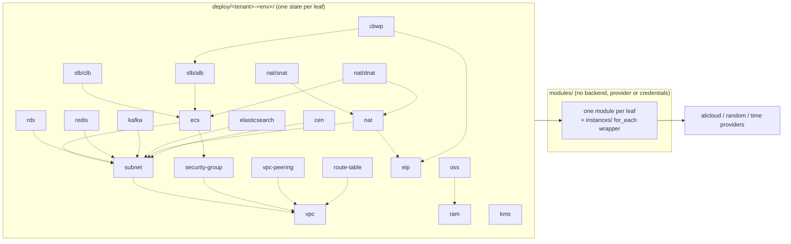
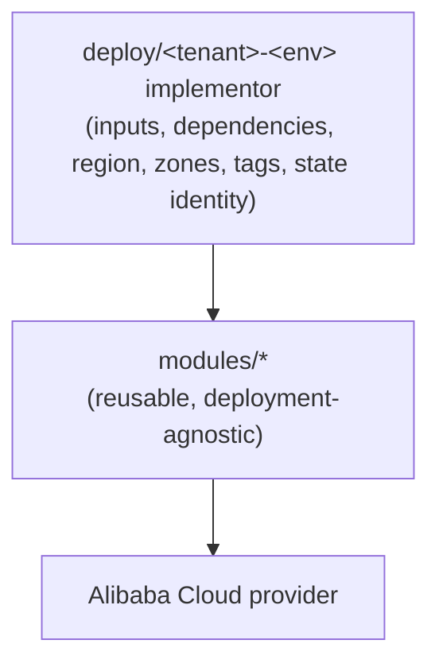
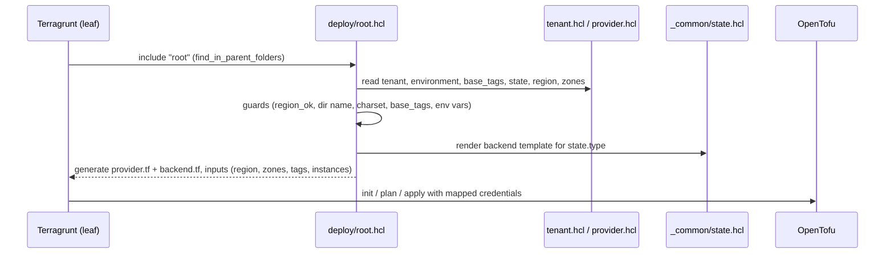
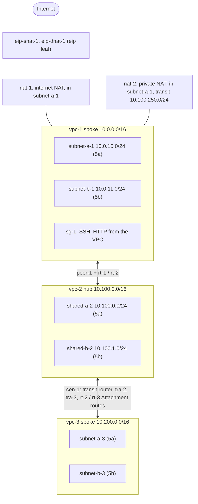

# OpenTofu for Alibaba Cloud — Architecture

Infrastructure-as-code platform for Alibaba Cloud: reusable OpenTofu modules, a Terragrunt implementor layer per tenant/environment, and Atlantis as the MR/PR execution gate. One leaf directory is one state is one Atlantis project. **Values:** see the instance files of `deploy/example-stage` — never guess.

---

## Module Map

Leaf → module edges (solid) and leaf → leaf dependencies (dotted, read from the other leaf's state). Dependencies marked "only when" are disabled until an instance file refers to them.



---

## 1. Layers



Do not make a module read files from `deploy/`, and do not make it depend on another tenant's files.

| Component | Path | Role |
|---|---|---|
| **VPC** | `modules/vpc` | VPC and stable VPC outputs. |
| **Subnet** | `modules/subnet` | vSwitch topology, multi-zone mappings. |
| **EIP** | `modules/eip` | EIPs and optional associations. |
| **NAT** | `modules/nat` | Enhanced NAT gateways, internet and intranet (NAT IP CIDR, transit IPs, route). |
| **NAT SNAT / DNAT** | `modules/nat-snat`, `modules/nat-dnat` | Source and destination NAT entries, port mappings. |
| **Security Group** | `modules/security-group` | Security groups and rules. |
| **VPC Peering** | `modules/vpc-peering` | Same-account peering, intra- or inter-region, requester side; peer-CIDR routes. |
| **Route Table** | `modules/route-table` | Custom route tables (optional vSwitch binding) or routes in an existing table. |
| **CEN** | `modules/cen` | CEN Enterprise Edition transit router for one region: VPC and inter-region peer attachments, system route table association and propagation. |
| **CBWP** | `modules/cbwp` | Shared bandwidth package, attaches EIPs and Internet-facing ALBs. |
| **KMS** | `modules/kms` | Keys and aliases in an existing KMS instance. |
| **RAM** | `modules/ram` | RAM user with one AccessKey, the principal of bucket policies. |
| **OSS** | `modules/oss` | Private or public buckets: 30s settle wait, public-access block, ACL, RAM-user policy, encryption, versioning, lifecycle. |
| **RDS** | `modules/rds` | MySQL, PostgreSQL, MariaDB with backup policy, databases, accounts, privileges. |
| **Redis** | `modules/redis` | Redis OSS (`alicloud_kvstore_instance`) or Tair (`alicloud_redis_tair_instance`), chosen by `instance_type`. |
| **Kafka** | `modules/kafka` | Instance, topics, consumer groups, VPC allow-list, SASL users and ACLs. |
| **Elasticsearch** | `modules/elasticsearch` | VPC-only cluster, optional dedicated masters and Kibana. |
| **ECS** | `modules/ecs` | Instances, key pairs, data disks, generated passwords, network and security group attachments. |
| **CLB / ALB** | `modules/slb-clb`, `modules/slb-alb` | Classic and Application Load Balancers with listeners and backends (ALB: zones, server groups, rules). |
| **Provider layer** | generated `provider.tf` | Region and credential context; child modules never hardcode credentials. |
| **State layer** | generated `backend.tf` | Owned by the implementor, never by a module. |
| **Atlantis** | `atlantis.yaml` | Explicit project per leaf, autodiscovery disabled. |

---

## 2. Root include (`deploy/root.hcl`)



Guards that fail before any resource is touched:

- region missing or invalid (`region_ok`);
- directory name differs from `<tenant>-<env>` of `tenant.hcl` (a copied tenant that kept the old file would share state keys and credentials);
- `tenant` not lower case letters, digits and `-`; `environment` anything but lower case letters and digits;
- `base_tags` missing from `tenant.hcl`;
- missing backend settings, unknown `state.type`, or `s3` with an `aliyuncs.com` endpoint;
- missing provider or state credential variable, a global `TF_VAR_*` input override, or an unprefixed credential variable (section 6);
- an empty leaf, an instance file without `name`, a duplicate `name`.

---

## 3. Leaf and instance files

- One leaf per component, one state per leaf. `terragrunt.hcl` is wiring only and is never edited; every value you change lives in an instance file next to it.
- Every `*.hcl` beside a leaf's `terragrunt.hcl` is one instance. Its `name` value is the resource name and the `for_each` key. The file name is free-form: renaming a file changes neither resource nor state.
- `subnet` groups its files in folders named after their VPC (`subnet/<vpc-name>/*.hcl`); still one state.
- Modules whose resource is a single object are driven through `modules/<m>/instances/`, a thin `for_each` wrapper.
- An unknown key in an instance file (a typo) fails the leaf: `known`, `unknown` and `keys_ok` in the leaf compare the file's keys with the allowed list.
- `scripts/check-deploy.sh` fails a `terragrunt.hcl` that holds a `-c1-` name, CIDR or region literal, adds tags of its own, or reads the environment (`get_env`, `run_cmd`).

Leaf pattern (`deploy/example-stage/vpc/terragrunt.hcl`, shortened):

```hcl
include "root" {
  path   = find_in_parent_folders("root.hcl")
  expose = true
}

locals {
  known = [
    "name", "tags", "cidr_block", "description",
  ]
  unknown = [
    for n, f in include.root.locals.instances : "instance ${n}: unknown key(s) ${join(", ", sort(setsubtract(keys(f), local.known)))}"
    if length(setsubtract(keys(f), local.known)) > 0
  ]
  keys_ok = lookup({ ok = "ok" }, length(local.unknown) == 0 ? "ok" : join("; ", local.unknown))
  members = { for n, f in include.root.locals.instances : n => f if local.keys_ok == "ok" }
}

terraform {
  source = "${include.root.locals.modules_dir}//vpc/instances"
}

inputs = {
  instances = {
    for n, f in local.members : n => {
      cidr_block  = f.cidr_block
      description = try(f.description, null)
      tags        = try(f.tags, {})
    }
  }

  tags = include.root.locals.base_tags
}
```

Naming is `<component>-<instance>-c1-<tenant>-<env>` (`c1` is a fixed infix), for example `vpc-1-c1-example-stage`. Names are deterministic, with no random suffix unless the Alibaba API requires one. A rename can mean destroy/create.

---

## 4. Module contract

Every module normally holds `versions.tf`, `vars.tf`, `main.tf`, `output.tf`. Optional: `locals.tf`, `data.tf`, `validation.tf`, `README.md`, `examples/`, `tests/`, and `instances/` (the `for_each` wrapper a leaf drives). Unit tests live in `modules/*/tests/` and `modules/*/instances/tests/`.

Required properties: explicit inputs and outputs, validation for critical topology, mandatory `tags`, no credentials, no environment-specific hardcoding, deterministic names, stable outputs, no hidden backend.

Zones (subnet, ecs, cen, slb-alb and slb-clb take them; the value comes from `provider.hcl` through the root `inputs.zones`):

```hcl
variable "zones" {
  type        = list(string)
  description = "Registered availability zones."
  nullable    = false

  validation {
    condition     = length(var.zones) >= 1
    error_message = "At least one availability zone must be registered."
  }
}
```

Tags (every provisionable component):

```hcl
variable "tags" {
  type        = map(string)
  description = "Resource tags. At least one tag is required."
  nullable    = false

  validation {
    condition     = length(var.tags) >= 1
    error_message = "At least one tag is required."
  }

  validation {
    condition     = alltrue([for k, v in var.tags : length(k) > 0 && length(v) > 0])
    error_message = "Tag keys and values must not be empty."
  }
}
```

Tenant tags are defined once in `deploy/<tenant>-<env>/tenant.hcl` (`base_tags = { env = local.environment }`) and forwarded unchanged by `root.hcl` and every leaf. Each instance file adds its own `tags = { product = "example" }`. The merge, instance wins on a clash, happens in the `instances/` wrappers; ecs and eip merge inside the module, subnet in `modules/subnet/main.tf`. `root.hcl` holds no tag values.

---

## 5. Remote state

Logical identity: `<tenant>/<environment>/<leaf path>/<stack>.tfstate`. The stack is the leaf path with `/` replaced by `-`, followed by `-<tenant>-<env>`, so `nat/snat` becomes `nat-snat-example-stage`.

```text
example/stage/vpc/vpc-example-stage.tfstate
example/stage/ecs/ecs-example-stage.tfstate
example/stage/nat/snat/nat-snat-example-stage.tfstate
```

`tenant.hcl` selects the backend in `state.type`:

| type | Required settings | Locking |
|---|---|---|
| `s3` | `bucket`, `region`, `endpoint` | `use_lockfile = true`; refused when `endpoint` is an Alibaba OSS host (`aliyuncs.com`) |
| `oss` | `bucket`, `region`, `endpoint`, `tablestore_endpoint`, `tablestore_table` | Tablestore row (`LockID`) |
| `gitlab` | `base_url`, `project_id` | HTTP POST lock / DELETE unlock |
| `gitea` | `base_url`, `owner` | HTTP POST lock / DELETE unlock; needs a Gitea with the Terraform state registry (1.26+) |
| `http` | `base_url` | HTTP LOCK / UNLOCK |

An unknown `type` or a missing setting fails at Terragrunt time. HTTP backends flatten `/` in the key to `--` because they address a state by one name. The key is part of the deployment contract; changing it needs a backup and a migration plan.

### Alibaba OSS state

`type = "s3"` against OSS cannot lock: `use_lockfile = true` makes OpenTofu send `If-None-Match: *` on PutObject, and OSS answers `400 NotImplemented`. `root.hcl` therefore rejects `s3` with an `aliyuncs.com` endpoint. Use `type = "oss"`, which locks through a Tablestore row. Both `tablestore_endpoint` and `tablestore_table` are required: the backend silently skips locking when the table is empty. The `aliyuncs.com` check is case-insensitive but only sees the endpoint text: a CNAME or custom domain pointing at OSS is not detected, and such an `s3` state cannot lock.

Prerequisites, created outside this repository: the OSS bucket, a Tablestore instance, a table in it whose only primary key is `LockID` (String), and a RAM user for state with read/write on the bucket and on that table. `<TENANT>_<ENV>_STATE_*` is mapped to `ALICLOUD_ACCESS_KEY_ID` and `ALICLOUD_ACCESS_KEY_SECRET`, which the backend reads and the provider does not, so the state identity never signs provider calls. Confirming the lock with two concurrent plans needs a real account (`TASKS.md`).

---

## 6. Credentials

Every variable starts with the tenant and environment (`<TENANT>_<ENV>_`, upper case, `-` replaced by `_`), so one Atlantis server can hold several tenants. `deploy/root.hcl` maps them to the names the provider and backend read, in the tofu process environment only. The variable list is in the root [README](../README.md#-credentials).

- **Enforced up front:** a missing provider or state credential variable fails before any resource, naming the variable. The check runs for `init`, `plan`, `apply`, `destroy`, `output`, `import`, `refresh`, `show`, `state`, `force-unlock`, `taint`, `untaint`, `console` and `workspace`; the same commands get the mapped variables. Offline `validate` needs none of them.
- **Not enforced up front:** `ECS_IMAGE_ID` and `KMS_INSTANCE_ID` are fallbacks. An empty value fails module validation at plan ("instance_type and image_id are required." in ecs, "dkms_instance_id must not be empty." in kms).
- **Refused:** a global `TF_VAR_password`, `TF_VAR_account_passwords`, `TF_VAR_redis_passwords`, `TF_VAR_kafka_sasl_passwords`, `TF_VAR_elasticsearch_passwords`; any leaf input as `TF_VAR_*` (`region`, `zones`, `tags`, `instances`, `groups`, `eips`, `private_key_dir`: Terragrunt skips an input whose `TF_VAR_*` is already set, so it would override every tenant); or an unprefixed provider/AWS credential (`ALICLOUD_ACCESS_KEY`, `ALICLOUD_SECRET_KEY`, `ALICLOUD_SECURITY_TOKEN`, `ALIBABA_CLOUD_SECURITY_TOKEN`, `ALIBABA_CLOUD_PROFILE`, `ALICLOUD_PROFILE`, `ALIBABA_CLOUD_ROLE_ARN`, `ALICLOUD_ASSUME_ROLE_ARN`, `AWS_SESSION_TOKEN`, `AWS_PROFILE`). The list in `env_global` is the whole refusal set.
- `terragrunt render --json` prints the mapped values: do not run it with real secrets.

Where each secret comes from:

| Secret | Source |
|---|---|
| ECS login | key pair (`key_name`, `public_key` or `generate_key_pair` in the instance file), else `<PREFIX>_ECS_PASSWORD`, else a random password (default 8 characters, `password_length`) |
| RDS accounts | `<PREFIX>_RDS_ACCOUNT_PASSWORDS`; an account without an entry gets a random password (default 8, `password_length`) |
| Redis/Tair, Kafka SASL, Elasticsearch | `<PREFIX>_REDIS_PASSWORDS`, `<PREFIX>_KAFKA_SASL_PASSWORDS`, `<PREFIX>_ELASTICSEARCH_PASSWORDS`; an instance or user without an entry gets a random password (default 16) |
| Generated secrets | sensitive output `generated_passwords` of the `ecs`, `rds`, `ram`, `redis`, `kafka`, `elasticsearch` stacks (`ram`: each RAM user's AccessKey ID and secret); a generated ECS private key goes once to `<instance>.pem` in the leaf directory |

---

## 7. Example landing zone

`deploy/example-stage` holds a complete hub-and-spoke network. Paths are under `deploy/example-stage/`; every instance file is named `<name>.hcl` with the `-c1-example-stage` suffix, shortened below.

- Public NAT uses two EIPs, each in its own file under `eip/`: `eip-snat-1` (outbound) and `eip-dnat-1` (inbound). Both use `PayByTraffic`, the only charge type an international pay-as-you-go EIP accepts (SNAT 10 Mbit/s, DNAT 5 Mbit/s). The DNAT leaf fails at Terragrunt time if a DNAT shares its EIP or transit IP with an SNAT on the same NAT.
- International site: EIPs and CLBs accept `PayByTraffic` only. Listener `bandwidth` on a CLB is documented for domestic-site accounts only, so use `-1` (unlimited).
- Hub and spoke: `vpc-1` (spoke, `10.0.0.0/16`) and `vpc-2` (hub, `10.100.0.0/16`), both in the `vpc` leaf. `nat-1` is the internet gateway and `nat-2` the intranet one, both in the `nat` leaf. The private NAT gateway sits in the spoke and translates through NAT IPs (transit IPs). The transit range `10.100.250.0/24` is reserved in the hub address plan, not a vSwitch. The provider requires it to be private, /16-/32 and outside the spoke VPC CIDR.
- Private SNAT (from the spoke) and DNAT (to the spoke) each reference their own named transit IP (`transit_ip`); the two must differ. The `nat` module routes the transit CIDR to the NAT gateway in the spoke's system route table.
- `vpc-peering` (`peer-1`) connects `vpc-1` and `vpc-2` in the same account; the request is accepted automatically. Enable Cloud Data Transfer on first use and allow the peer CIDR in security groups.
- `route-table` holds `rt-1` (vpc-1), `rt-2` (vpc-2) and `rt-3` (vpc-3). `rt-1` and `rt-2` add the route to the other VPC (`VpcPeer` via `peer-1`) to that VPC's system route table. The example peering sets `routes = false`; without it the peering adds the same two routes itself, and declaring them in both places is rejected as a duplicate destination. For an inter-region peering the accepter-side route always belongs in a `route-table` stack in the accepter's region.
- `route-table` is a standalone component. Each instance file names the VPC (`vpc`), optionally `custom = true` (a table named after `name`; unset adds to the VPC system table), optionally vSwitches to bind, and routes whose `nexthop` is a resource name from `vpc-peering`, `nat` or `cen` (`Attachment`); a literal `nexthop_id` covers resources not managed here. Custom-table mode is unit-tested only.
- `cen` (`cen-1`) holds the transit router with two VPC attachments: `tra-2` for the hub `vpc-2` and `tra-3` for the spoke `vpc-3` (`10.200.0.0/16`, `subnet-a-3`, `subnet-b-3`). Each attachment is associated with and propagates to the transit router's system route table. `vpc-1` stays on `peer-1`; a CEN route for the same CIDRs would duplicate the peering routes. The routes to the transit router are `Attachment` routes in `route-table` (`rt-2` `to-cen-spoke`, `rt-3` `to-hub`). Open the Transit Router service once in the console before the first apply; it is not automated because the provider activates it at plan time, irreversibly. Each attachment is billed hourly plus traffic.
- Instance files reference other resources by name (`vpc = "vpc-1-c1-example-stage"`); dependency paths are fixed per component.
- Not modelled: cross-account peering accepter, CEN custom transit router route tables and multi-region providers in one state, VPN, and the peer-side routes for NAT traffic (peer CIDR to the NAT gateway, NAT vSwitch to the transit router).



Leaf order (a number is the apply level; leaves with the same number are independent):

| Order | Leaf (state) | Instance files | Creates | Reads from |
|---|---|---|---|---|
| 1 | `vpc` | `vpc-1`, `vpc-2`, `vpc-3` | spoke, hub and CEN spoke VPC | none |
| 1 | `kms` | `kms-1`, `kms-2` | keys and aliases in the existing KMS instance | none |
| 1 | `ram` | `ram-oss-1`, `ram-oss-2` | RAM users with one AccessKey each | none |
| 1 | `eip` | `eip-snat-1`, `eip-dnat-1` | two public IPs (outbound `PayByTraffic` 10 Mbit/s, inbound `PayByTraffic` 5 Mbit/s) | none |
| 2 | `subnet` | `vpc-1-…/subnet-a-1`, `subnet-b-1`; `vpc-2-…/shared-a-2`, `shared-b-2`; `vpc-3-…/subnet-a-3`, `subnet-b-3` | one vSwitch per zone in each VPC | `vpc` |
| 2 | `security-group` | `sg-1` | security group with SSH and HTTP from the VPC CIDR | `vpc` |
| 2 | `vpc-peering` | `peer-1` | spoke to hub peering, auto-accepted, `routes = false` | `vpc` |
| 2 | `oss` | `oss-1`, `oss-2` | buckets with bucket policy for a RAM user | `ram`; `kms` only when an instance file sets `kms_key` |
| 3 | `ecs` | `bastion-1`, `app-1` | compute instances | `subnet`, `security-group`; `kms` only when a disk sets `kms_key` |
| 3 | `rds` | `rds-1`, `rds-2` | database instances with databases and accounts | `vpc`, `subnet`; `kms` only when an instance file sets `kms_key` |
| 3 | `redis` | `redis-1` (Redis, two zones), `redis-2` (Tair `tair_rdb`) | managed in-memory databases, allowed clients default to the VPC CIDR | `vpc`, `subnet` |
| 3 | `kafka` | `kafka-1` | Kafka instance with topics, a consumer group, a SASL user and its ACLs | `vpc`, `subnet`; `security-group` only when an instance file refers to one |
| 3 | `elasticsearch` | `es-1` | two-zone cluster with dedicated masters and Kibana, no public access | `vpc`, `subnet` |
| 3 | `nat` | `nat-1` (internet), `nat-2` (intranet) | public NAT bound to both EIPs; private NAT with transit IPs `10.100.250.10` and `.20` | `vpc`, `subnet`, `eip` |
| 3 | `cen` | `cen-1` | CEN, transit router, hub and spoke VPC attachments with route table association and propagation | `vpc`, `subnet` |
| 4 | `nat/snat` | `snat-1`, `snat-2` | `snat-1`: both subnets out through `eip-snat-1`; `snat-2`: `subnet-b-1` through transit IP | `nat`, `subnet`, `eip` |
| 4 | `slb/clb` | `clb-1`, `clb-2` | Classic Load Balancers with listeners and backends | `subnet`, `ecs` |
| 4 | `slb/alb` | `alb-1`, `alb-2` | Application Load Balancers with server groups, listeners and rules | `vpc`, `subnet`, `ecs` |
| 4 | `route-table` | `rt-1`, `rt-2`, `rt-3` | peering and CEN routes in each VPC's system route table | `vpc`; `subnet`, `vpc-peering`, `nat`, `cen` only when an instance file refers to them |
| later | `cbwp` | `cbwp-1` | shared bandwidth package (20 Mbit/s) holding both EIPs and the Internet ALB `alb-2` | `eip`, `slb/alb` |
| later | `nat/dnat` | `dnat-1`, `dnat-2` | inbound mappings (80 and 8080) to `app-1` | `nat`, `eip`, `ecs` |

Traffic flows:

- **Outbound internet:** both spoke subnets use `snat-1` on `nat-1`; all egress leaves from `eip-snat-1`.
- **Inbound internet:** `dnat-1` maps port 80 on `eip-dnat-1` to `app-1`; egress and ingress IPs are separate.
- **Spoke to hub:** `peer-1` links the VPCs; `rt-1` and `rt-2` add the route to the other CIDR.
- **Hub to CEN spoke:** `cen-1` attaches `vpc-2` and `vpc-3` to one transit router; `rt-2` and `rt-3` route the other CIDR to the attachment.
- **Private NAT:** `nat-2` translates through transit IPs from `10.100.250.0/24`.

---

## 8. Untaggable resources

Resources without a `tags` argument in the provider carry no tags: CEN route table associations and propagations, security group rules, SNAT/DNAT entries, NAT IPs, route entries, EIP/disk/route-table attachments, shared bandwidth package attachments (EIP and ALB), KMS aliases, OSS ACL, public-access block and bucket policy, RAM AccessKeys, private NAT IP CIDRs (`alicloud_vpc_nat_ip_cidr`), CLB server-group attachments, RDS backup policy/database/account/privilege, Kafka allowed-IP attachments, SASL users and ACLs, ALB rules and CLB listeners. Their modules still require `tags` for contract parity; the security group itself, EIPs, NAT gateways and the other taggable resources are tagged.

---

## 9. Provider lock files

Each leaf carries a `.terraform.lock.hcl` (the repo has no commits yet, so it is kept in the tree). The files came from `tofu providers lock` on 2026-10-02 for linux_amd64, darwin_amd64, darwin_arm64 and windows_amd64; redis, kafka and elasticsearch are copies of the rds file and cen is a copy of the vpc file (2026-10-07). Regeneration is in [WORKFLOWS.md](WORKFLOWS.md#7-provider-lock-regeneration). Atlantis needs registry access to the same providers.

---

## 10. Key Design Decisions

1. **One state per leaf, one Atlantis project per leaf.** A project directory maps to one state boundary, and Atlantis locks per leaf. A project for the whole tenant would put 21 states behind one plan file.
2. **Autodiscovery off.** Atlantis would take the directory of each changed file as the project, never walk up to a `terragrunt.hcl`, ignore instance `*.hcl` files, plan nothing for a `modules/` change, and give autodiscovered projects neither the workflow nor `when_modified`. It would also risk `deploy/example-*` becoming an execution target.
3. **Tenant-prefixed environment.** One Atlantis server holds several tenants without credentials leaking between them; global overrides are refused.
4. **Mock outputs only for `validate` and `init`.** A `plan` never uses mocks; an unapplied dependency fails the plan.
5. **Backend `oss` for Alibaba OSS.** `s3` cannot lock on OSS (`400 NotImplemented`), so it is rejected at Terragrunt time. Locking is never disabled to work around contention.
6. **Private NAT independent of peering and route-table (2026-10-02).** `nat` routes its own transit CIDR.
7. **Transit Router activation not automated.** The provider activates it at plan time, irreversibly.
8. **No static scanner adopted (2026-10-02).** tflint has no alicloud ruleset, trivy has no alicloud checks, checkov is not adopted. Validation blocks and `tofu test` are the gate.
9. **Generated secrets appear in the MR/PR comment (owner decision 2026-10-01, extended 2026-10-02 and 2026-10-04).** Applies to ECS/RDS logins, `generate_key_pair` keys, RAM AccessKeys and Redis/Kafka/Elasticsearch passwords. Operator-supplied secrets are never output. Rotate after first login.
10. **The example tenant is reference only.** It is never an Atlantis project; `scripts/check-atlantis.sh` fails on any `example-` match in `atlantis.yaml`.
11. **Instance files carry every value; leaves are wiring.** A reviewer reads one small file per change and the guards reject typos instead of ignoring them.
12. **Standing rule for wrapper validations.** Optional keys arrive as `null`, so wrapper `instances/vars.tf` checks use `coalesce(try(i.X, null), …)` and never assume a non-null collection.
