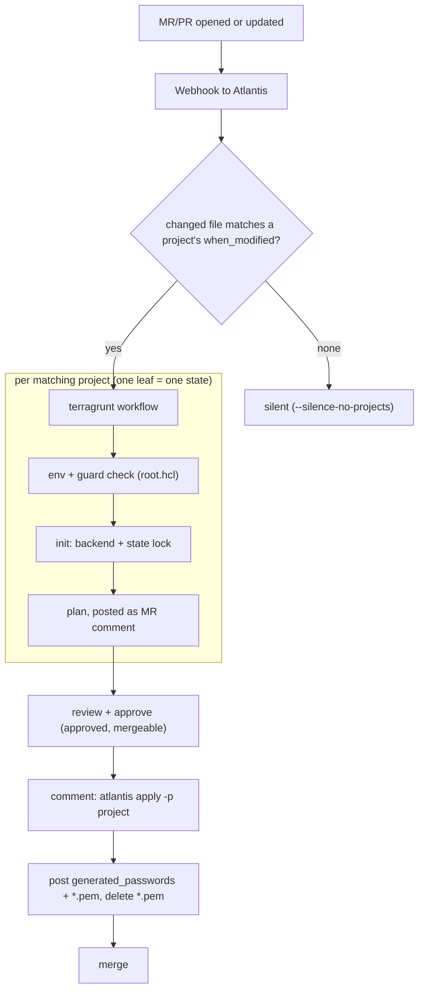
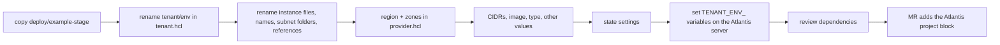
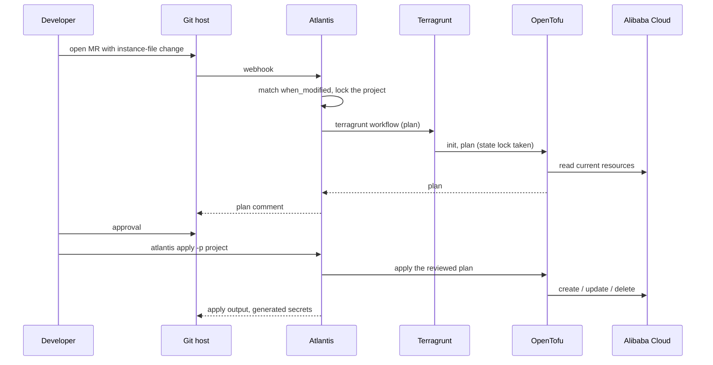
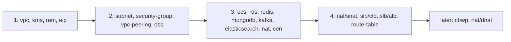
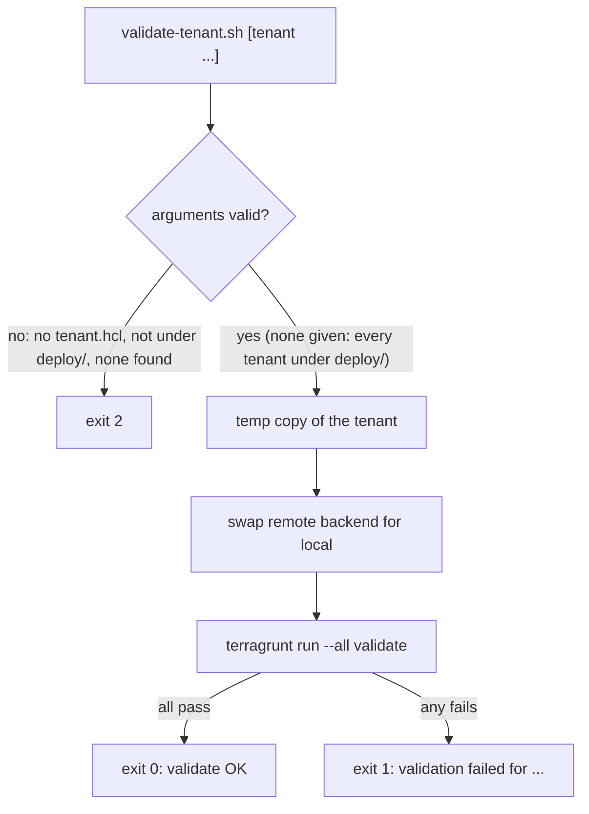

# OpenTofu for Alibaba Cloud — Workflows

How changes move from a merge request to Alibaba Cloud, and the procedures around it. For what each part is, see [ARCHITECTURE.md](ARCHITECTURE.md).

---

## Pipeline Overview



Atlantis does not order projects against each other: apply upstream leaves first, then plan dependents (stage 4).

---

## Stage Details

### 1. Onboard a tenant



1. Copy `deploy/example-stage` to `deploy/<tenant>-<env>`.
2. Rename the tenant/env in `tenant.hcl`, and rename every `*-c1-example-stage.hcl` instance file, the names inside them, the `subnet/<vpc-name>/` folders and every reference to another instance's name (`vpc`, `subnet`, `ram_user`, `eip`, …). Do not edit any `terragrunt.hcl`: `bash scripts/check-deploy.sh` fails if one holds a `-c1-` name, CIDR or region literal, adds tags of its own, or reads the environment (`get_env`, `run_cmd`). An unknown key in an instance file (a typo such as `polcy`) fails the leaf instead of being ignored.
3. Replace region and zones (`provider.hcl`), state settings, and the CIDRs, ECS image/type and other values in the instance files. Replace the `EXAMPLE_STAGE_` prefix of every variable in the [README credentials table](../README.md#-credentials) with your tenant and environment in upper case (tenant `example`, env `prod` gives `EXAMPLE_PROD_ALIBABA_CLOUD_ACCESS_KEY_ID` and so on), then set them on the Atlantis server.
4. Review dependencies, then open a MR that adds your tenant's project block to `atlantis.yaml` (stage 2).

Before planning the example, export `EXAMPLE_STAGE_ECS_IMAGE_ID` (a public image in the target region, used by the ecs leaf) and `EXAMPLE_STAGE_KMS_INSTANCE_ID` (an existing KMS instance, used by the kms leaf).

Dependencies between leaves:

- ecs reads `subnet` and `security-group`, and `kms` when an instance file sets a disk `kms_key`.
- rds reads `vpc` and `subnet`, and `kms` when an instance file sets `kms_key`.
- slb/clb reads `subnet` and `ecs`; slb/alb reads `vpc`, `subnet` and `ecs`.
- redis and elasticsearch read `vpc` and `subnet`.
- mongodb reads `vpc` and `subnet`, and `kms` when an instance file sets `kms_key`.
- kafka reads `vpc` and `subnet`, and `security-group` when an instance file refers to one.
- oss reads `ram` (each bucket's `ram_user`), and `kms` when an instance file sets `kms_key`.

### 2. Register Atlantis projects

`atlantis.yaml` keeps `autodiscover.mode: disabled` (reasons: [ARCHITECTURE.md](ARCHITECTURE.md#10-key-design-decisions)). Projects are listed once per tenant and Atlantis decides per MR which of them to plan. Atlantis reads only this root file ([docs](https://www.runatlantis.io/docs/repo-level-atlantis-yaml.html)); it has no per-tenant file or include. `deploy/example-*` is never listed.

A project is planned when one of these changes (paths are relative to the project dir; `d` is the leaf depth, 1 for `vpc`, 2 for `nat/snat`):

| Change | `when_modified` |
|---|---|
| The leaf's own instance files | `*.hcl` (`subnet`: `**/*.hcl`, its files sit in `<vpc-name>/` folders) |
| `tenant.hcl`, `provider.hcl` | `d` times `../` then `*.hcl` |
| `deploy/root.hcl` | `d+1` times `../` then `root.hcl` |
| `deploy/_common/*.hcl` | `d+1` times `../` then `_common/*.hcl` |
| The leaf's own module and its `instances/` wrapper | `d+2` times `../` then `modules/<module>/**/*.tf` |

`nat/dnat` also lists `../snat/*.hcl`, because it reads the SNAT leaf. Editing `vpc-1-c1-….hcl` therefore plans only `<tenant>-vpc`; editing `modules/nat/main.tf` plans only `<tenant>-nat`; editing `tenant.hcl` plans every leaf of that tenant. README and `*.tftest.hcl` edits plan nothing.

Copy this block into `projects:` of `atlantis.yaml` and replace `acme-prod` with your tenant and environment. Every project is written out in full; depth 1 uses `../`, depth 2 uses `../../`:

```yaml
projects:
  # depth 1: deploy/acme-prod/<leaf>.
  - name: acme-prod-vpc
    dir: deploy/acme-prod/vpc
    workflow: terragrunt
    terraform_distribution: opentofu
    autoplan:
      when_modified:
        - "*.hcl"
        - "../*.hcl"
        - "../../root.hcl"
        - "../../_common/*.hcl"
        - "../../../modules/vpc/**/*.tf"

  - name: acme-prod-subnet
    dir: deploy/acme-prod/subnet
    workflow: terragrunt
    terraform_distribution: opentofu
    autoplan:
      when_modified:
        - "**/*.hcl"
        - "../*.hcl"
        - "../../root.hcl"
        - "../../_common/*.hcl"
        - "../../../modules/subnet/**/*.tf"

  - name: acme-prod-eip
    dir: deploy/acme-prod/eip
    workflow: terragrunt
    terraform_distribution: opentofu
    autoplan:
      when_modified:
        - "*.hcl"
        - "../*.hcl"
        - "../../root.hcl"
        - "../../_common/*.hcl"
        - "../../../modules/eip/**/*.tf"

  - name: acme-prod-security-group
    dir: deploy/acme-prod/security-group
    workflow: terragrunt
    terraform_distribution: opentofu
    autoplan:
      when_modified:
        - "*.hcl"
        - "../*.hcl"
        - "../../root.hcl"
        - "../../_common/*.hcl"
        - "../../../modules/security-group/**/*.tf"

  - name: acme-prod-vpc-peering
    dir: deploy/acme-prod/vpc-peering
    workflow: terragrunt
    terraform_distribution: opentofu
    autoplan:
      when_modified:
        - "*.hcl"
        - "../*.hcl"
        - "../../root.hcl"
        - "../../_common/*.hcl"
        - "../../../modules/vpc-peering/**/*.tf"

  - name: acme-prod-nat
    dir: deploy/acme-prod/nat
    workflow: terragrunt
    terraform_distribution: opentofu
    autoplan:
      when_modified:
        - "*.hcl"
        - "../*.hcl"
        - "../../root.hcl"
        - "../../_common/*.hcl"
        - "../../../modules/nat/**/*.tf"

  - name: acme-prod-route-table
    dir: deploy/acme-prod/route-table
    workflow: terragrunt
    terraform_distribution: opentofu
    autoplan:
      when_modified:
        - "*.hcl"
        - "../*.hcl"
        - "../../root.hcl"
        - "../../_common/*.hcl"
        - "../../../modules/route-table/**/*.tf"

  - name: acme-prod-kms
    dir: deploy/acme-prod/kms
    workflow: terragrunt
    terraform_distribution: opentofu
    autoplan:
      when_modified:
        - "*.hcl"
        - "../*.hcl"
        - "../../root.hcl"
        - "../../_common/*.hcl"
        - "../../../modules/kms/**/*.tf"

  - name: acme-prod-ecs
    dir: deploy/acme-prod/ecs
    workflow: terragrunt
    terraform_distribution: opentofu
    autoplan:
      when_modified:
        - "*.hcl"
        - "../*.hcl"
        - "../../root.hcl"
        - "../../_common/*.hcl"
        - "../../../modules/ecs/**/*.tf"

  - name: acme-prod-ram
    dir: deploy/acme-prod/ram
    workflow: terragrunt
    terraform_distribution: opentofu
    autoplan:
      when_modified:
        - "*.hcl"
        - "../*.hcl"
        - "../../root.hcl"
        - "../../_common/*.hcl"
        - "../../../modules/ram/**/*.tf"

  - name: acme-prod-oss
    dir: deploy/acme-prod/oss
    workflow: terragrunt
    terraform_distribution: opentofu
    autoplan:
      when_modified:
        - "*.hcl"
        - "../*.hcl"
        - "../../root.hcl"
        - "../../_common/*.hcl"
        - "../../../modules/oss/**/*.tf"

  - name: acme-prod-rds
    dir: deploy/acme-prod/rds
    workflow: terragrunt
    terraform_distribution: opentofu
    autoplan:
      when_modified:
        - "*.hcl"
        - "../*.hcl"
        - "../../root.hcl"
        - "../../_common/*.hcl"
        - "../../../modules/rds/**/*.tf"

  - name: acme-prod-redis
    dir: deploy/acme-prod/redis
    workflow: terragrunt
    terraform_distribution: opentofu
    autoplan:
      when_modified:
        - "*.hcl"
        - "../*.hcl"
        - "../../root.hcl"
        - "../../_common/*.hcl"
        - "../../../modules/redis/**/*.tf"

  - name: acme-prod-mongodb
    dir: deploy/acme-prod/mongodb
    workflow: terragrunt
    terraform_distribution: opentofu
    autoplan:
      when_modified:
        - "*.hcl"
        - "../*.hcl"
        - "../kms/*.hcl"
        - "../../root.hcl"
        - "../../_common/*.hcl"
        - "../../../modules/mongodb/**/*.tf"

  - name: acme-prod-kafka
    dir: deploy/acme-prod/kafka
    workflow: terragrunt
    terraform_distribution: opentofu
    autoplan:
      when_modified:
        - "*.hcl"
        - "../*.hcl"
        - "../../root.hcl"
        - "../../_common/*.hcl"
        - "../../../modules/kafka/**/*.tf"

  - name: acme-prod-elasticsearch
    dir: deploy/acme-prod/elasticsearch
    workflow: terragrunt
    terraform_distribution: opentofu
    autoplan:
      when_modified:
        - "*.hcl"
        - "../*.hcl"
        - "../../root.hcl"
        - "../../_common/*.hcl"
        - "../../../modules/elasticsearch/**/*.tf"

  - name: acme-prod-nat-snat
    dir: deploy/acme-prod/nat/snat
    workflow: terragrunt
    terraform_distribution: opentofu
    autoplan:
      when_modified:
        - "*.hcl"
        - "../../*.hcl"
        - "../../../root.hcl"
        - "../../../_common/*.hcl"
        - "../../../../modules/nat-snat/**/*.tf"

  - name: acme-prod-nat-dnat
    dir: deploy/acme-prod/nat/dnat
    workflow: terragrunt
    terraform_distribution: opentofu
    autoplan:
      when_modified:
        - "*.hcl"
        - "../snat/*.hcl"
        - "../../*.hcl"
        - "../../../root.hcl"
        - "../../../_common/*.hcl"
        - "../../../../modules/nat-dnat/**/*.tf"

  - name: acme-prod-slb-alb
    dir: deploy/acme-prod/slb/alb
    workflow: terragrunt
    terraform_distribution: opentofu
    autoplan:
      when_modified:
        - "*.hcl"
        - "../../*.hcl"
        - "../../../root.hcl"
        - "../../../_common/*.hcl"
        - "../../../../modules/slb-alb/**/*.tf"

  - name: acme-prod-slb-clb
    dir: deploy/acme-prod/slb/clb
    workflow: terragrunt
    terraform_distribution: opentofu
    autoplan:
      when_modified:
        - "*.hcl"
        - "../../*.hcl"
        - "../../../root.hcl"
        - "../../../_common/*.hcl"
        - "../../../../modules/slb-clb/**/*.tf"

  - name: acme-prod-cen
    dir: deploy/acme-prod/cen
    workflow: terragrunt
    terraform_distribution: opentofu
    autoplan:
      when_modified:
        - "*.hcl"
        - "../*.hcl"
        - "../../root.hcl"
        - "../../_common/*.hcl"
        - "../../../modules/cen/**/*.tf"

  - name: acme-prod-cbwp
    dir: deploy/acme-prod/cbwp
    workflow: terragrunt
    terraform_distribution: opentofu
    autoplan:
      when_modified:
        - "*.hcl"
        - "../*.hcl"
        - "../../root.hcl"
        - "../../_common/*.hcl"
        - "../../../modules/cbwp/**/*.tf"
```

Why these values:

- `name` is `<tenant>-<env>-<leaf>` (the leaf path with `/` as `-`). It is unique per project, and the tenant and env in it show which environment a plan comment belongs to.
- `dir` is one leaf directory. A leaf is exactly one state, so one Atlantis project is one state boundary and Atlantis locks per leaf. One project for the whole tenant directory would put 22 states behind one plan file and one lock, so it is not used.
- `workflow: terragrunt` is the only workflow; it runs OpenTofu through Terragrunt.
- Only the module line and the depth prefix differ per leaf. Atlantis' parser rejects unknown top-level keys, so there is no `defaults:` block.

`bash scripts/check-atlantis.sh` fails when `atlantis.yaml` enables autodiscovery, uses flow-style projects, repeats a project name or `dir`, defines a second workflow, has a project without `workflow: terragrunt` or `terraform_distribution: opentofu`, names a project `dir` without a `terragrunt.hcl`, or mentions `example-` anywhere.

### 3. Plan and apply through Atlantis



- Atlantis does not plan a leaf because a leaf it reads from changed. After applying the upstream leaf, comment `atlantis plan -p acme-prod-subnet` (and so on) for the dependents, in the order of [ARCHITECTURE.md](ARCHITECTURE.md#7-example-landing-zone).
- Run Atlantis with `--silence-no-projects` so MRs that touch only documentation stay quiet.
- Server hardening: a plan runs the MR's code with every tenant's environment variables in scope. Set `allowed_overrides: []` and `apply_requirements: [approved, mergeable]` in the server-side `repos.yaml`, and prefer one credential set per Atlantis server where tenants must not see each other's access.
- Atlantis plan and apply operate on the same reviewed change. Never auto-apply, auto-approve or auto-merge. Atlantis' project lock does not replace the backend state lock.

### 4. Apply order



1. Apply a leaf only after every leaf it reads from is applied; the numbers give the order, and leaves with the same number are independent. Terragrunt reads each dependency's outputs from its state, so an unapplied dependency fails the plan. The per-leaf table is in [ARCHITECTURE.md](ARCHITECTURE.md#7-example-landing-zone).
2. `cbwp` reads `eip` and `slb/alb` (which reads `ecs`), so it is applied after the load balancers. Removing a name from its `eips`/`albs` detaches only that attachment.
3. `nat/dnat` reads `ecs`, so it is applied after the compute stacks (those need `EXAMPLE_STAGE_ECS_IMAGE_ID` and `EXAMPLE_STAGE_KMS_INSTANCE_ID`). The rest of the network is complete without it.
4. Atlantis does not infer this order between projects; apply the MRs or run `atlantis apply -p <project>` in this order.

Dependency `mock_outputs` are limited to `validate` and `init`; a `plan` never uses mocks.

### 5. Local and CI validation

```bash
export TF_CLI_CONFIG_FILE=...     # only if your provider mirror needs it
tofu fmt -check -recursive modules
(cd deploy && terragrunt hcl fmt --check)
(cd modules/<m> && tofu init -backend=false && tofu test)
(cd modules/<m>/instances && tofu init -backend=false && tofu test)   # modules with an instances/ wrapper
bash scripts/validate-tenant.sh                # offline validate of every tenant under deploy/
bash scripts/validate-tenant.sh acme-prod      # one or more tenants, by name or path
bash scripts/check-atlantis.sh
bash scripts/check-deploy.sh                   # terragrunt.hcl holds no user values; leaf layouts, env and backend renders checked
```



`validate-tenant.sh` needs no state or tenant credentials but still needs registry access or a provider mirror (`TF_CLI_CONFIG_FILE`). It swaps the backend for `local` in a temp copy because Terragrunt reads dependency outputs from state even for `validate`. Example CI step:

```bash
bash scripts/check-atlantis.sh && bash scripts/check-deploy.sh && bash scripts/validate-tenant.sh
```

Apply, destroy, state surgery and backend migration run only through Atlantis or an explicit, reviewed procedure.

### 6. Generated secrets

- Sensitive output `generated_passwords` of `ecs`, `rds`, `ram`, `redis`, `mongodb`, `kafka`, `elasticsearch`, and a generated ECS private key as `<instance>.pem` in the leaf directory.
- The single `terragrunt` Atlantis workflow prints both after apply, then deletes the `.pem` files, also when the apply fails. They appear in the MR/PR comment, so everyone with read access to the MR/PR and its email notifications sees them (owner decision, see [ARCHITECTURE.md](ARCHITECTURE.md#10-key-design-decisions)).
- Stacks without generated secrets print nothing. Do not reuse the output name `generated_passwords` for anything else.
- Rotate after the first login. Operator-supplied secrets are never output.

### 7. Provider lock regeneration

Only for a deliberate provider constraint change. Needs registry access and tenant credentials:

```bash
terragrunt run --all -- providers lock -platform=linux_amd64 -platform=darwin_amd64 -platform=darwin_arm64 -platform=windows_amd64
```

Review the diff of every `.terraform.lock.hcl`, then run the plans of the affected implementors. Do not upgrade providers during unrelated tasks.

---

## File Naming Conventions

| Item | Pattern | Example |
|---|---|---|
| Resource / instance name | `<component>-<instance>-c1-<tenant>-<env>` | `vpc-1-c1-example-stage` |
| Instance file | free-form `*.hcl` next to the leaf `terragrunt.hcl`, keyed by its `name` value | `vpc-1-c1-example-stage.hcl` |
| Subnet instance file | `subnet/<vpc-name>/<name>.hcl` | `subnet/vpc-1-c1-example-stage/subnet-a-1-c1-example-stage.hcl` |
| Leaf entrypoint | `terragrunt.hcl`, wiring only | `deploy/example-stage/vpc/terragrunt.hcl` |
| Stack name | leaf path with `/` as `-`, then `-<tenant>-<env>` | `nat-snat-example-stage` |
| State key | `<tenant>/<env>/<leaf path>/<stack>.tfstate` | `example/stage/nat/snat/nat-snat-example-stage.tfstate` |
| HTTP state name | state key with `/` flattened to `--` | `example--stage--nat--snat--nat-snat-example-stage.tfstate` |
| Atlantis project | `<tenant>-<env>-<leaf>` | `acme-prod-nat-snat` |
| Tenant env prefix | `<TENANT>_<ENV>_`, upper case, `-` as `_` | `EXAMPLE_STAGE_` |
| Generated key | `<instance>.pem` in the leaf directory (deleted after apply) | `bastion-1-c1-example-stage.pem` |
| Provider lock | `.terraform.lock.hcl` per leaf | `deploy/example-stage/vpc/.terraform.lock.hcl` |

---

## Error Recovery

Messages are quoted from `deploy/root.hcl`, the leaf `terragrunt.hcl` files, the module validations and `scripts/*.sh`.

| Scenario | Message | Recovery |
|---|---|---|
| Credential variable missing | `missing environment variables: EXAMPLE_STAGE_...` | Set the named tenant-prefixed variables on the Atlantis server or shell. Offline `validate` needs none. |
| Global variable set | `global TF_VAR_password is set; unset it and use the EXAMPLE_STAGE_-prefixed variables (...)` | Unset the global `TF_VAR_*` or unprefixed credential variable named; use the prefixed one. |
| Directory name differs from `tenant.hcl` | `tenant.hcl: tenant-environment '...' must equal the tenant directory name '...'` | Rename the directory or fix `tenant`/`environment`. A copied tenant that kept the old file would share state keys and credentials. |
| Bad tenant or environment charset | `tenant.hcl: tenant must match ^[a-z]([a-z0-9-]*[a-z0-9])?$` / `tenant.hcl: environment must match ^[a-z0-9]+$ (no '-')` | Fix the value in `tenant.hcl`. |
| Tags missing | `tenant.hcl must define base_tags (at least one tag)` | Add `base_tags` to `tenant.hcl`. |
| Region invalid | `provider.hcl: region must be an Alibaba Cloud region ID, e.g. ap-southeast-5` | Fix `region` in `provider.hcl`. |
| Backend type or settings | `tenant.hcl: state.type must be one of: ...` / `state.<type> is missing settings: ...` | Fix `state` in `tenant.hcl`. |
| s3 backend on Alibaba OSS | `tenant.hcl: state.s3 cannot lock on Alibaba OSS (OSS rejects If-None-Match); use type = "oss" with tablestore_endpoint and tablestore_table` | Switch to `type = "oss"`. Never disable locking. A fresh state moves with a backup and a plan check. |
| Empty leaf or unnamed instance file | `leaf <path>: no instance file (*.hcl) found` / `leaf <path>: instance file without a name value: ...` | Add an instance file, or give the file a `name`. A duplicate `name` fails as `Duplicate object key`. |
| Unknown instance-file key | `instance <name>: unknown key(s) <keys>` | Fix the typo, or add a real key to the module and the leaf's `known` list. |
| DNAT shares an address with an SNAT | `<dnat> and <snat> both use <ip> on <nat>` | Give the DNAT its own EIP or transit IP. |
| DNAT without address | `instance <name>: set eip or transit_ip` | Set `eip` or `transit_ip` in the instance file. |
| Dependency not applied | `terragrunt` fails reading the dependency's outputs | Apply the upstream leaf first (stage 4), then `atlantis plan -p <project>` again. Do not add mock outputs to a plan path. |
| State lock held | `Error acquiring the state lock` | Wait for the running plan/apply. Use `force-unlock` only through a reviewed procedure after confirming nothing runs. Never disable locking. |
| Image or KMS instance empty | `instance_type and image_id are required.` / `dkms_instance_id must not be empty.` | Export `<PREFIX>_ECS_IMAGE_ID` or `<PREFIX>_KMS_INSTANCE_ID`, or set the value in the instance files. |
| Transit Router service not open | Provider error at plan on the `cen` leaf | Open the Transit Router service once in the console, then re-plan. Not automated: activation is irreversible. |
| `check-atlantis.sh` fails | `FAIL: autodiscover.mode must be disabled`, `FAIL: atlantis.yaml references an example-* tenant`, `FAIL: duplicate project ...`, `FAIL: project dir ... has no terragrunt.hcl` | Fix `atlantis.yaml` as the message says. |
| `check-deploy.sh` fails | `FAIL: <file> holds a user value (tenant name, CIDR or region)` / `... holds an IP address` / `... calls get_env/run_cmd; only deploy/root.hcl may` | Move the value to an instance file; keep `terragrunt.hcl` wiring only. |
| `validate-tenant.sh` exit 2 | `FAIL: <arg> is not a tenant directory (no tenant.hcl)` / `... is not directly under deploy/` / `FAIL: no tenant found under deploy/` | Pass a tenant directory name or path under `deploy/`. |
| `validate-tenant.sh` exit 1 | `FAIL: validation failed for: <tenants>` | Read the Terragrunt/OpenTofu error above it, fix the instance file or module. |
